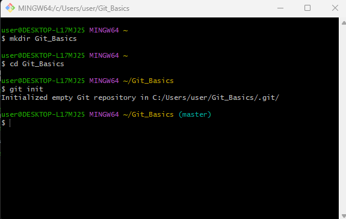
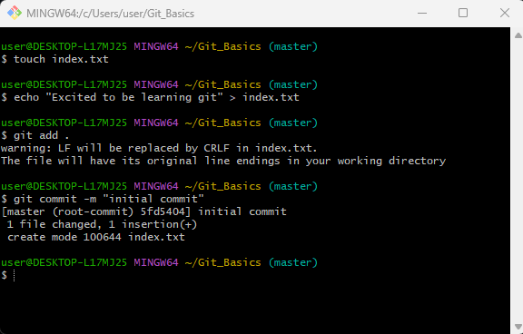
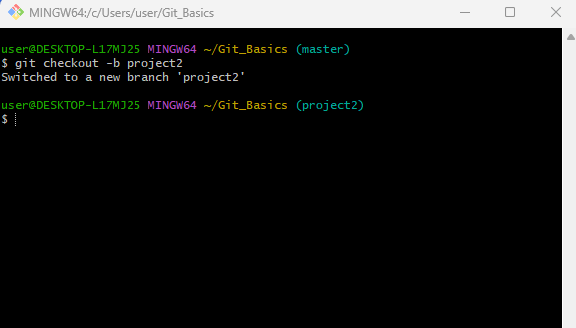
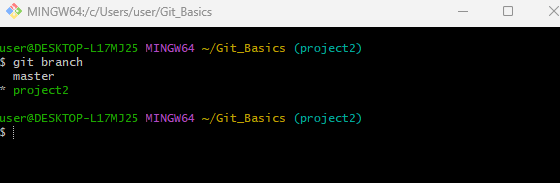
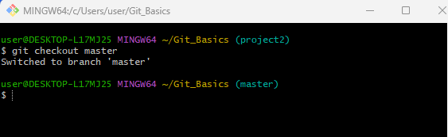
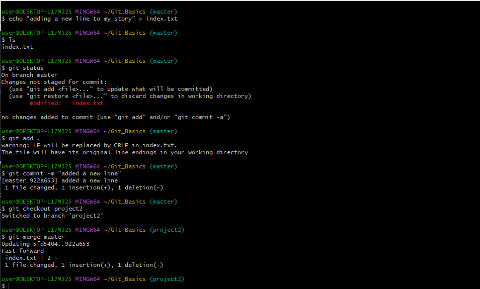
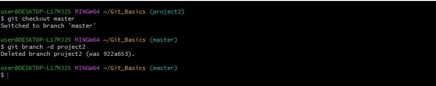
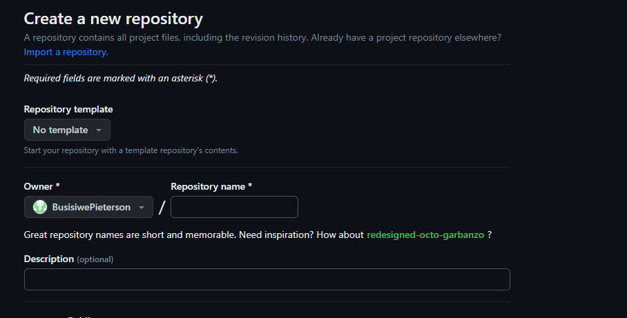
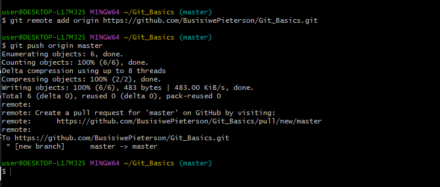
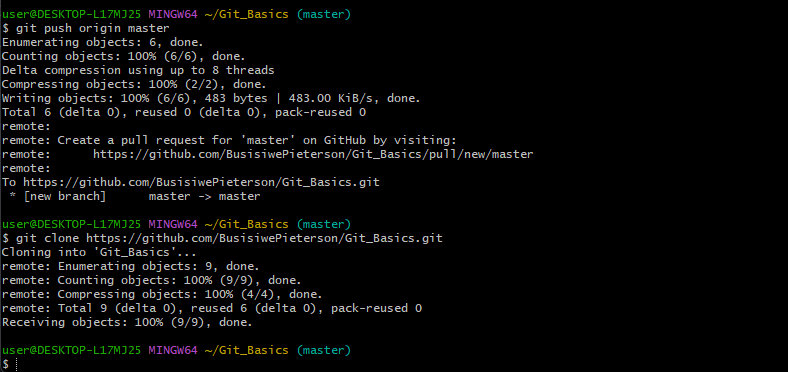

# Git_Github_Basics

### What is Git ?

Git is a widely used version control system for tracking changes in computer files. Version control is like a savings program for your project. By tracking and logging the changes you make to your file or file sets over time, a version-control system gives you the power to review or even restore earlier versions. Version control takes snapshots of every revision to your project. You can then access these versions to compare or restore them as needed.

### **Initializing a Git Repository**

`git init` : The command git init is used to create an empty Git repository.

`git add` : Add command is used after checking the status of the files, to add those untracked files to the staging area. The command is also used to add modified files. 

`git commit` : The commit command makes sure that the changes are saved to the local repository.
  - **-m** : allows you to write a commit message to describe the commit that you have made.

#### *Working with Branches*

`git checkout -b <branch name>` : The git checkout command is used to switch branches, whenever the work is to be started on a different branch.
Checkout can also be used to create a new branch.

`git branch` : This command is used to list all the branches in your local git repository

`git checkout <branch_name>` : Change into an existing branch

### **Merging a Branch into another Branch**

`git merge <branch_name>` : The "merge" command is used to integrate changes from another branch

`git branch -d <branch_name` : This command is used to delete a branch.

## **Collaboration and Remote Repositories**

### What is Github?

We now know what git is but how will developers working remotely work on the same code base? This is where Github comes in. GitHub is a code hosting platform for collaboration and version control.

Through GitHub, you can share your code with others, giving them the power to make revisions or edits on your various Git branches. This makes it possible for entire teams to work together on single projects in real-time. As changes are introduced, new branches are created, allowing the team to continue to revise the code without overwriting each other’s work. 

sign up to Github here https://github.com/

### Create your First Repository

  > 1. click on the plus sign at the top right corner, in the dropdown menu select, new repository.
  > 2. click the green button **(Create repository)** to create a repository

### Pushing your Local git Repo to your Remote Github Repository

`git remote add origin <link to github repo>` : used to add a remote repository to your local Git repository. By providing the remote URL you establish a connection between your local and remote repo.

`git push origin <branch_name>` : git command that pushes a local branch to a remote repository.

`git clone <link to remote repo>` : used to create a copy of a specific repository or branch within a repository.

## **Branch Management and Tagging**

  > 1. Headings: To create a heading use the has symbol at the beginning of the line

  `# Heading 1` : # Heading 1

  `## Heading 2` : ## Heading 2

  `### Heading 3` : ### Heading 3

 > 2. Emphasis: asterics are used for italic

 `*italics*` - *italics*
   
 `**bold**` - **bold**

 > 3. Lists: listing items, ordered and unordered

 undordered list:

 `- item 1` 

 - item 1
 - item 2
 - item 3

 ordered list:

 1. First item
 2. Second item
 3. Third item

 > 4. Links: Used to create a hyperlink

 visit `[darey.io]`(https://www.darey.io)

 > 5. Images: To disply an image

``

 > 6. Code: To display code snippets, use backticks to enclose code.

 `console.log('Hello World!)`

 *******

                             # THE END !! 

